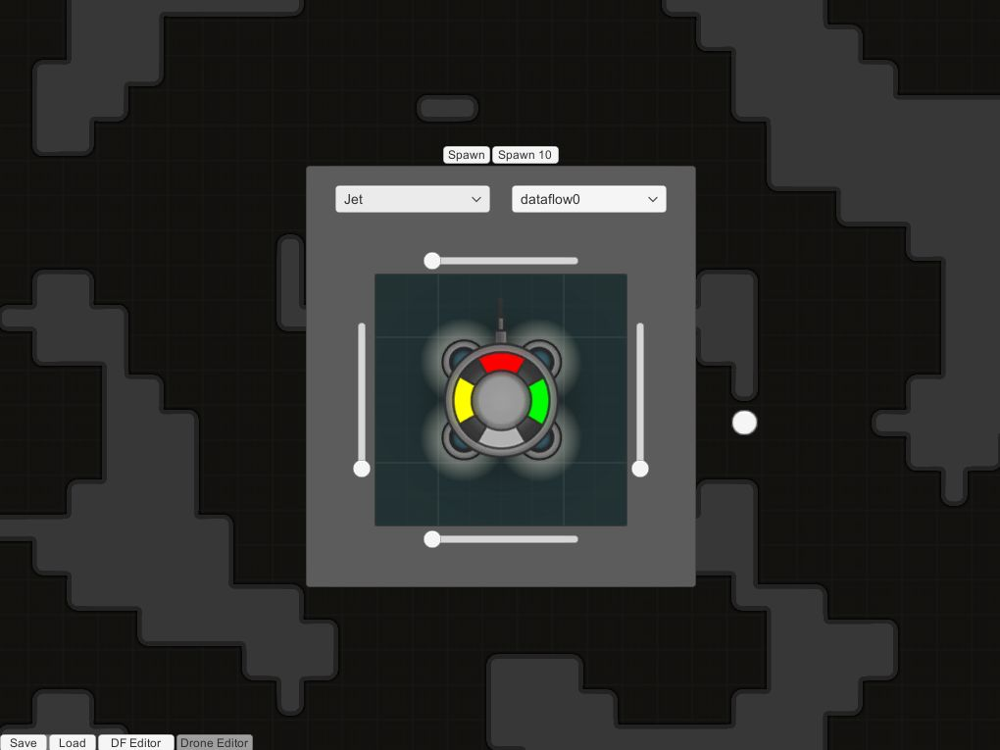

# DroneConquest
Design drones AI using flow diagrams, and send them to explore and conquest planets.  
</img>

## Note
[Go to my C# scripts](Assets/Scripts)

## Implemented features

### Flow diagram editor
</img>
- saving/loading diagrams
- multiple nodes to control AI and get data
- assigning diagrams to drones
- debug mode

### Drone editor
</img>
- selecting chassis
- assigning AI diagram
- spawning

### AI Drones
</img>
- A* pathfinding movement

### World
- randomly generated terrain tiles

